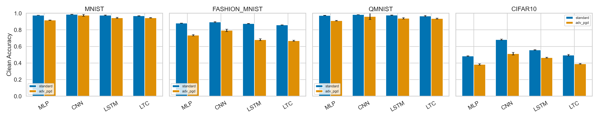
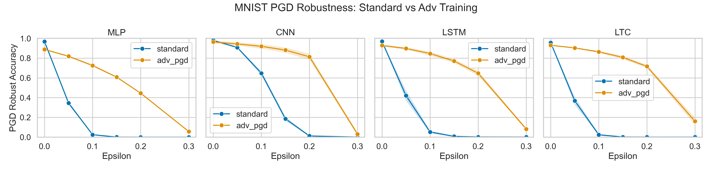
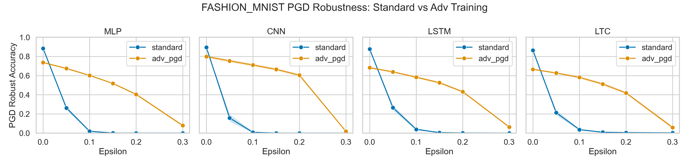
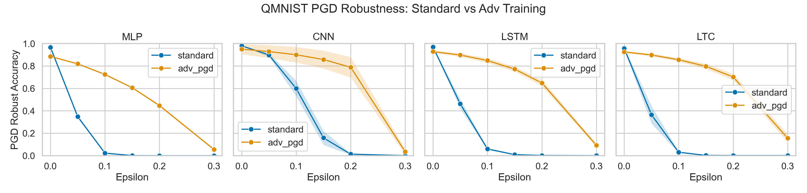
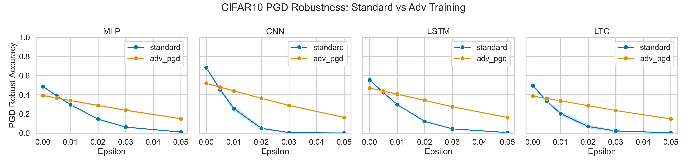

# Adversarial Robustness of Liquid Time-Constant Networks
## A Multi-Dataset Benchmark Against LSTMs and Feedforward Baselines

**Jack Large**  
Independent Researcher

## Abstract
Liquid neural networks are often presented as adaptive continuous-time systems with strong generalization properties. Whether those dynamics provide adversarial robustness is still underexplored. This paper presents a controlled robustness benchmark across four datasets (MNIST, Fashion-MNIST, QMNIST, CIFAR-10), four model families (MLP, CNN, LSTM, LTC), two attack classes (FGSM, PGD), and two training regimes (standard ERM, PGD adversarial training), with five seeds per condition. Main result: LTC does not show consistent inherent adversarial robustness over LSTM under standard training. Under adversarial training, performance improves strongly for all architectures, but the relative LTC-LSTM advantage is dataset-dependent. This supports a null-but-important conclusion: architecture class alone does not remove gradient-based vulnerability.

## 1. Introduction
Adversarial examples remain a central obstacle for deep learning systems [5, 6]. Liquid Time-Constant (LTC) networks [1], Neural Circuit Policies (NCPs) [2], and related continuous-time models such as Closed-form Continuous-time networks (CfC) [3] are biologically inspired recurrent architectures with adaptive internal dynamics. A natural question is whether those dynamics improve adversarial robustness.

This study evaluates that question directly using matched training/evaluation protocols and explicit contamination checks. The core comparison is LSTM [4] vs LTC [1], with MLP and CNN baselines to test whether any effect is specific to recurrent vs feedforward families.

## 2. Related Work
LTC [1] and NCP [2] introduced liquid/continuous-time recurrent computation for control and sequence reasoning, with later work extending efficiency and closed-form dynamics [3]. Adversarial vulnerability in neural nets is well established [5, 6], and transferability across model classes is a robust empirical effect [7]. Prior work also warns against misleading robustness claims due to gradient masking or evaluation artifacts [8], motivating strong white-box attacks and transparent protocols.

## 3. Experimental Setup
### 3.1 Datasets
- MNIST [9]
- Fashion-MNIST [10]
- QMNIST [11]
- CIFAR-10 [12]

### 3.2 Models
- `MLP`: 2-hidden-layer feedforward baseline
- `CNN`: small convolutional baseline
- `LSTM`: row-wise sequence model from images
- `LTC`: row-wise sequence model with liquid time-constant cell

### 3.3 Training
- Standard ERM (`standard`)
- PGD adversarial training (`adv_pgd`, 3-step train-time PGD)
- Seeds: `41, 42, 43, 44, 45`
- Validation-based model selection with fixed train/val split protocol per seed

### 3.4 Attacks and Metrics
- White-box FGSM [5], white-box PGD [6]
- Epsilon grids:
  - MNIST/Fashion-MNIST/QMNIST: `0.00, 0.05, 0.10, 0.15, 0.20, 0.30`
  - CIFAR-10: `0.00, 0.005, 0.01, 0.02, 0.03, 0.05`
- Metric: robust accuracy curve and normalized PGD AUC (higher is better)
- Transferability: source-crafted adversarial examples evaluated on all target models

### 3.5 Contamination/Integrity Checks
To prevent data leakage claims, exact hash-based checks were run across train/test splits for all datasets, seed-wise train/val disjointness was verified, and expected per-seed result shard completeness was audited.

Output: [`paper_artifacts/contamination_report.md`](/Users/j8ck/research/paper_artifacts/contamination_report.md)

## 4. Results
### 4.1 Clean Accuracy
Under standard training, clean accuracy is high on digit datasets and lower on CIFAR-10 (as expected for compact models and short training). LSTM/LTC are close but not identical.

| Dataset | Defense | MLP | CNN | LSTM | LTC |
|---|---|---:|---:|---:|---:|
| MNIST | standard | 97.66 | 98.69 | 97.60 | 96.88 |
| MNIST | adv_pgd | 91.70 | 97.56 | 94.49 | 94.52 |
| Fashion-MNIST | standard | 88.11 | 89.49 | 87.56 | 85.88 |
| Fashion-MNIST | adv_pgd | 73.50 | 79.39 | 68.15 | 66.89 |
| QMNIST | standard | 97.37 | 98.37 | 97.67 | 96.69 |
| QMNIST | adv_pgd | 91.08 | 96.13 | 93.96 | 93.60 |
| CIFAR-10 | standard | 48.40 | 68.24 | 55.77 | 49.46 |
| CIFAR-10 | adv_pgd | 38.39 | 51.25 | 46.46 | 39.02 |

Values are mean test accuracy (%) across five seeds.

### 4.2 White-box PGD Robustness
PGD AUC summarizes full degradation curves.

| Dataset | Defense | MLP | CNN | LSTM | LTC |
|---|---|---:|---:|---:|---:|
| MNIST | standard | 0.1421 | 0.3746 | 0.1611 | 0.1453 |
| MNIST | adv_pgd | 0.5530 | 0.7462 | 0.6717 | 0.7124 |
| Fashion-MNIST | standard | 0.1207 | 0.1022 | 0.1247 | 0.1165 |
| Fashion-MNIST | adv_pgd | 0.4745 | 0.5751 | 0.4665 | 0.4566 |
| QMNIST | standard | 0.1423 | 0.3609 | 0.1699 | 0.1465 |
| QMNIST | adv_pgd | 0.5530 | 0.7298 | 0.6744 | 0.7037 |
| CIFAR-10 | standard | 0.1576 | 0.1294 | 0.1532 | 0.1096 |
| CIFAR-10 | adv_pgd | 0.2664 | 0.3318 | 0.3115 | 0.2632 |

Key observation: adversarial training increases PGD robustness across all architecture classes, but no architecture is robust by default.

### 4.3 Direct LTC vs LSTM Contrast (PGD AUC Delta)
`(LTC - LSTM)` mean difference with bootstrap 95% CI over seeds:

| Dataset | Standard | Adv-PGD |
|---|---:|---:|
| MNIST | -0.0158 [-0.0222, -0.0100] | +0.0407 [0.0238, 0.0614] |
| Fashion-MNIST | -0.0082 [-0.0174, -0.0000] | -0.0099 [-0.0177, -0.0022] |
| QMNIST | -0.0235 [-0.0355, -0.0112] | +0.0293 [0.0182, 0.0405] |
| CIFAR-10 | -0.0436 [-0.0511, -0.0366] | -0.0482 [-0.0523, -0.0438] |

This pattern is mixed rather than monotonic: LTC is not systematically better or worse than LSTM across datasets/regimes.

### 4.4 Transferability
Transfer asymmetry exists but is not unidirectional across all datasets. Example (standard training, PGD transfer robust accuracy; lower means stronger transfer attack):
- MNIST: LSTM->LTC `29.9%`, LTC->LSTM `26.4%`
- Fashion-MNIST: LSTM->LTC `4.3%`, LTC->LSTM `16.7%`
- QMNIST: LSTM->LTC `26.9%`, LTC->LSTM `28.3%`
- CIFAR-10: LSTM->LTC `22.1%`, LTC->LSTM `29.4%`

Interpretation: architectures learn partially overlapping but non-identical adversarial subspaces; asymmetry direction depends on dataset and training regime.

### 4.5 Integrity/Contamination Outcome
Contamination report status: `PASS`.
- Exact train/test overlap hashes: `0` for all four datasets.
- Seed-wise train/val intersection size: `0` for all splits.
- Expected per-seed shards: `40`; present: `40`; missing: `0`.

## 5. Figures (Seaborn)

## 6. Discussion
The central empirical outcome is a controlled null result: liquid architecture alone does not confer robust resistance to first-order white-box attacks. The largest shifts come from adversarial training, not from moving between recurrent architectural families.

This does not imply continuous-time models are uninteresting for robustness. Instead, it narrows the hypothesis space:
- If robustness gains exist, they likely require explicit robust objectives/training protocols.
- Architecture effects may be second-order and dataset-dependent.
- Transferability asymmetries suggest representational differences still worth deeper analysis (e.g., gradient alignment, frequency-domain perturbation structure).

## 7. Limitations and Next Steps
- Attack suite is first-order (`FGSM`, `PGD`); stronger evaluations (AutoAttack, CW, EOT variants) can be added.
- CIFAR-10 models were intentionally compact for tractability; larger-capacity variants may change absolute accuracy but are unlikely to reverse the core architecture-vs-training conclusion.
- Future work can include certified robustness bounds and larger continuous-time model variants.

## 8. Conclusion
Across four datasets, four model families, two defenses, and five seeds per condition, no consistent intrinsic adversarial robustness advantage for LTC over LSTM is observed under standard training. Robust training methods dominate architecture choice in determining white-box robustness.

## References
[1] R. Hasani, M. Lechner, A. Amini, D. Rus, and R. Grosu, "Liquid Time-constant Networks," *Proceedings of the AAAI Conference on Artificial Intelligence*, vol. 35, no. 9, pp. 7657-7666, 2021. DOI: 10.1609/aaai.v35i9.16936.  
[2] M. Lechner et al., "Neural Circuit Policies Enabling Auditable Autonomy," *Nature Machine Intelligence*, vol. 2, pp. 642-652, 2020. DOI: 10.1038/s42256-020-00237-3.  
[3] R. Hasani et al., "Closed-form Continuous-time Neural Networks," *Nature Machine Intelligence*, vol. 4, pp. 992-1003, 2022. DOI: 10.1038/s42256-022-00556-7.  
[4] S. Hochreiter and J. Schmidhuber, "Long Short-Term Memory," *Neural Computation*, vol. 9, no. 8, pp. 1735-1780, 1997. DOI: 10.1162/neco.1997.9.8.1735.  
[5] I. J. Goodfellow, J. Shlens, and C. Szegedy, "Explaining and Harnessing Adversarial Examples," arXiv:1412.6572, 2014.  
[6] A. Madry, A. Makelov, L. Schmidt, D. Tsipras, and A. Vladu, "Towards Deep Learning Models Resistant to Adversarial Attacks," arXiv:1706.06083, 2017.  
[7] N. Papernot et al., "Transferability in Machine Learning: From Phenomena to Black-box Attacks using Adversarial Samples," arXiv:1605.07277, 2016.  
[8] A. Athalye, N. Carlini, and D. Wagner, "Obfuscated Gradients Give a False Sense of Security," arXiv:1802.00420, 2018.  
[9] Y. LeCun et al., "Gradient-Based Learning Applied to Document Recognition," *Proceedings of the IEEE*, vol. 86, no. 11, pp. 2278-2324, 1998. DOI: 10.1109/5.726791.  
[10] H. Xiao, K. Rasul, and R. Vollgraf, "Fashion-MNIST: a Novel Image Dataset for Benchmarking Machine Learning Algorithms," arXiv:1708.07747, 2017.  
[11] C. Yadav and L. Bottou, "Cold Case: The Lost MNIST Digits," arXiv:1905.10498, 2019.  
[12] A. Krizhevsky, "Learning Multiple Layers of Features from Tiny Images," University of Toronto Technical Report, 2009.  
[13] M. Waskom, "seaborn: Statistical Data Visualization," *Journal of Open Source Software*, vol. 6, no. 60, p. 3021, 2021. DOI: 10.21105/joss.03021.
